## 👋 Hi, I'm Cuthbert

- Backend engineer, learner
- Java / Python / Go
- ⚽ Football · 🎸 Rock · 🎮 Gaming · 🏃 Sports

## 🖥️ Recently Activity

<!--START_SECTION:activity-->
1. 💪 Opened PR [#310](https://github.com/nacos-group/nacos-sdk-python/pull/310) in [nacos-group/nacos-sdk-python](https://github.com/nacos-group/nacos-sdk-python)
2. 💪 Opened PR [#309](https://github.com/nacos-group/nacos-sdk-python/pull/309) in [nacos-group/nacos-sdk-python](https://github.com/nacos-group/nacos-sdk-python)
3. ❗ Opened issue [#305](https://github.com/nacos-group/nacos-sdk-python/issues/305) in [nacos-group/nacos-sdk-python](https://github.com/nacos-group/nacos-sdk-python)
4. 🎉 Merged PR [#304](https://github.com/nacos-group/nacos-sdk-python/pull/304) in [nacos-group/nacos-sdk-python](https://github.com/nacos-group/nacos-sdk-python)
5. 🗣 Commented on [#253](https://github.com/nacos-group/nacos-sdk-python/pull/253#issuecomment-4036906950) in [nacos-group/nacos-sdk-python](https://github.com/nacos-group/nacos-sdk-python)
6. ❌ Closed PR [#253](https://github.com/nacos-group/nacos-sdk-python/pull/253) in [nacos-group/nacos-sdk-python](https://github.com/nacos-group/nacos-sdk-python)
7. 🗣 Commented on [#253](https://github.com/nacos-group/nacos-sdk-python/pull/253#issuecomment-4036904119) in [nacos-group/nacos-sdk-python](https://github.com/nacos-group/nacos-sdk-python)
8. 💪 Opened PR [#304](https://github.com/nacos-group/nacos-sdk-python/pull/304) in [nacos-group/nacos-sdk-python](https://github.com/nacos-group/nacos-sdk-python)
9. 🎉 Merged PR [#14579](https://github.com/alibaba/nacos/pull/14579) in [alibaba/nacos](https://github.com/alibaba/nacos)
10. 🗣 Commented on [#14579](https://github.com/alibaba/nacos/pull/14579#issuecomment-4021381248) in [alibaba/nacos](https://github.com/alibaba/nacos)
<!--END_SECTION:activity-->

## 📊 GitHub Stats

