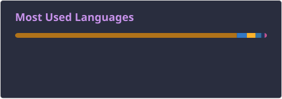

## 👋 Hi, I'm Cuthbert

Software Engineer @ Beijing · Nacos Committer [@alibaba](https://github.com/alibaba) | AI Coding Enthusiast | iOS Indie Dev

- Open source contributor, focused on [Nacos](https://github.com/alibaba/nacos) — multi-language SDK, code quality governance & CI/CD
- Exploring AI-assisted coding workflows
- Indie iOS developer, shipped [MomentGif](https://github.com/cxhello/MomentGif)
- Java / Python / Go / Swift · Kubernetes · Observability
- ⚽ Football · 🎸 Rock · 🎮 Gaming · 🏃 Sports

## 🖥️ Recently Activity

<!--START_SECTION:activity-->
1. ❗ Opened issue [#9759](https://github.com/makeplane/plane/issues/9759) in [makeplane/plane](https://github.com/makeplane/plane)
2. 🗣 Commented on [#521](https://github.com/nacos-group/nacos-docker/issues/521#issuecomment-5489920390) in [nacos-group/nacos-docker](https://github.com/nacos-group/nacos-docker)
3. 💪 Opened PR [#119](https://github.com/fastclaw-ai/fastclaw/pull/119) in [fastclaw-ai/fastclaw](https://github.com/fastclaw-ai/fastclaw)
4. ❗ Opened issue [#118](https://github.com/fastclaw-ai/fastclaw/issues/118) in [fastclaw-ai/fastclaw](https://github.com/fastclaw-ai/fastclaw)
5. 💪 Opened PR [#914](https://github.com/nacos-group/nacos-sdk-go/pull/914) in [nacos-group/nacos-sdk-go](https://github.com/nacos-group/nacos-sdk-go)
6. ❗ Opened issue [#913](https://github.com/nacos-group/nacos-sdk-go/issues/913) in [nacos-group/nacos-sdk-go](https://github.com/nacos-group/nacos-sdk-go)
7. 🗣 Commented on [#900](https://github.com/nacos-group/nacos-sdk-go/issues/900#issuecomment-5477045820) in [nacos-group/nacos-sdk-go](https://github.com/nacos-group/nacos-sdk-go)
8. 🗣 Commented on [#655](https://github.com/nacos-group/nacos-sdk-go/issues/655#issuecomment-5477044508) in [nacos-group/nacos-sdk-go](https://github.com/nacos-group/nacos-sdk-go)
9. 🗣 Commented on [#780](https://github.com/nacos-group/nacos-sdk-go/issues/780#issuecomment-5477043369) in [nacos-group/nacos-sdk-go](https://github.com/nacos-group/nacos-sdk-go)
10. 🔒 Closed issue [#900](https://github.com/nacos-group/nacos-sdk-go/issues/900) in [nacos-group/nacos-sdk-go](https://github.com/nacos-group/nacos-sdk-go)
<!--END_SECTION:activity-->

## 📊 GitHub Stats

